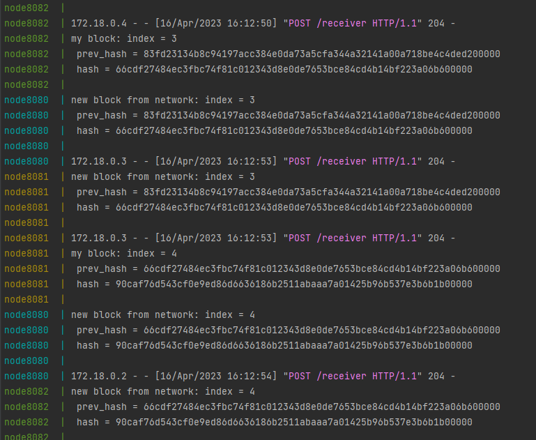

# MockChain
[](https://github.com/denis-shvetcov/MockChain/actions/workflows/main.yml)

Task for Network Programming course

## Docker
```
docker build -t chain . 
docker-compose up 
```
## Example
